# Linux Fundamentals: Exercises
This file contains quick practice exercises and knowledge checks.

# DevOps & Cloud Infrastructure Lab Exercises

This document serves as the visual compilation of the completed file management, process handling, security, and networking tasks executed across local Kali Linux environments and AWS EC2 Ubuntu infrastructure instances.

---

## Task  to 5: 
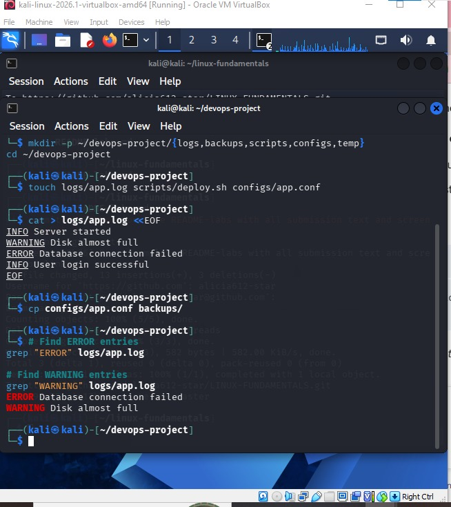

## Task6 to 10: 
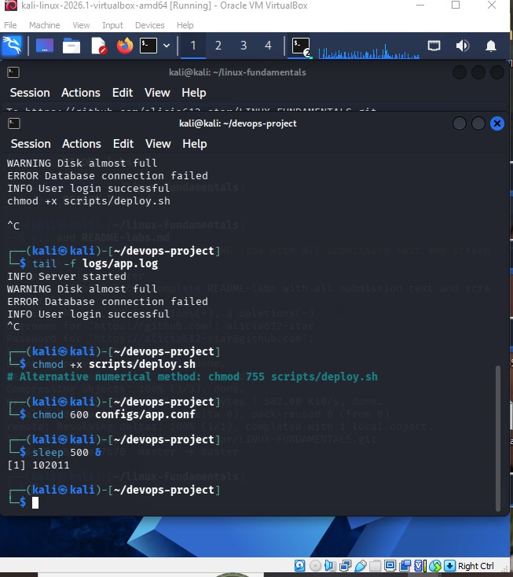

## Task 11 to 12:
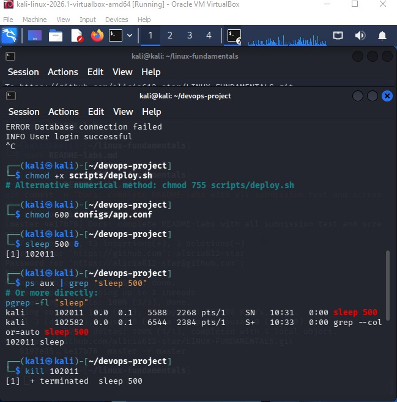

## Task 13: 
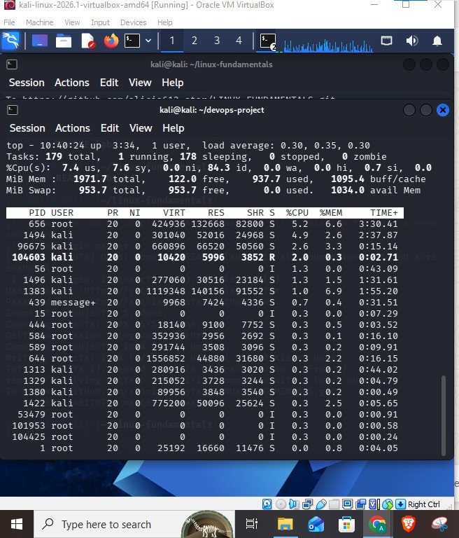

## Task 14: 
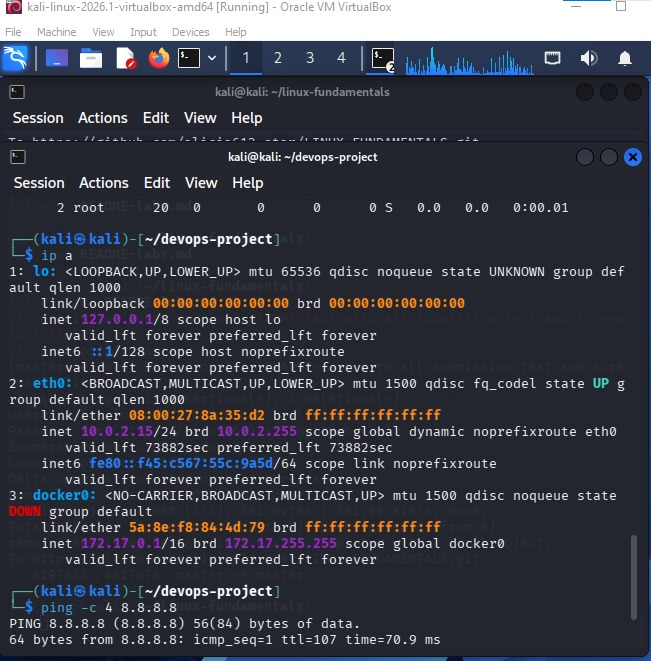

## Task 15 to 16:
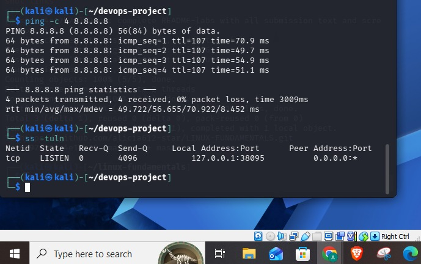

## Task 17: 
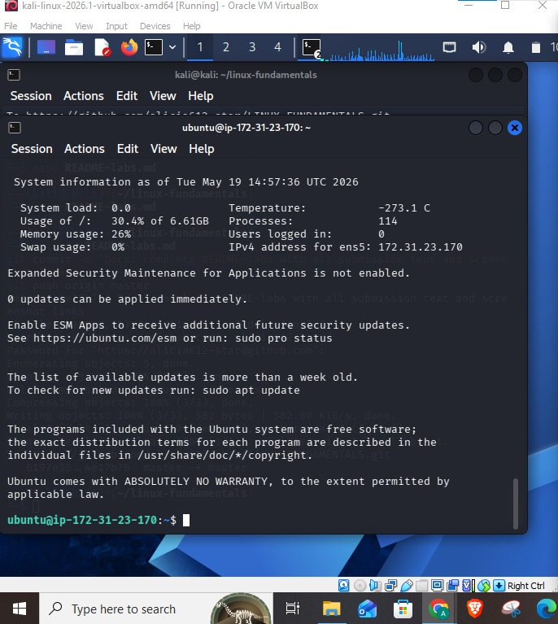

## Task 18: 
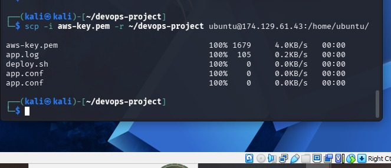

## Task 19: 
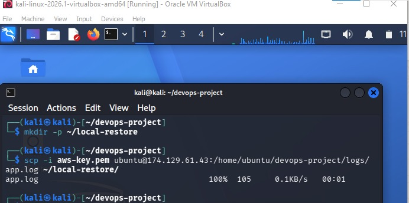

## Task 20: 
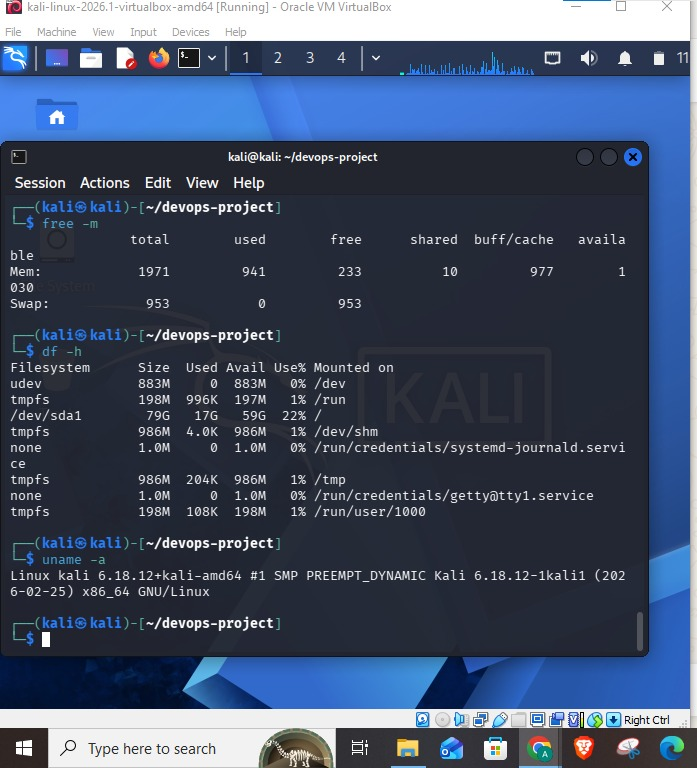

## Task 21 to 22:
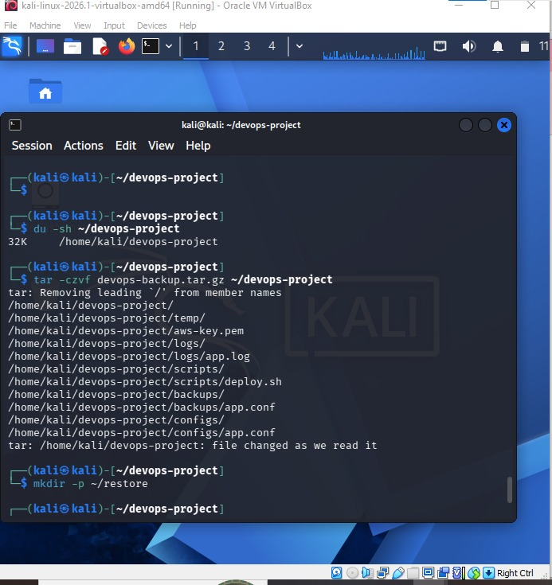

## Task23: 
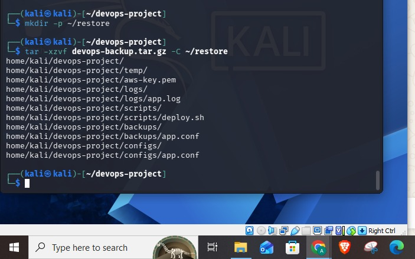

