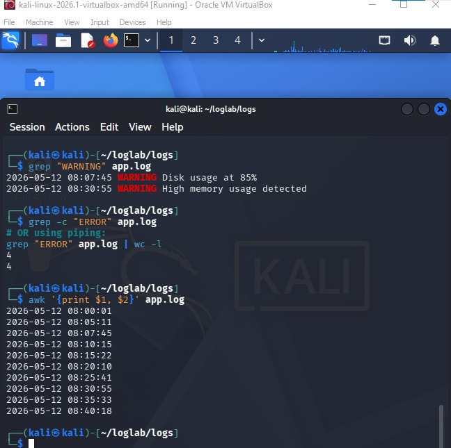
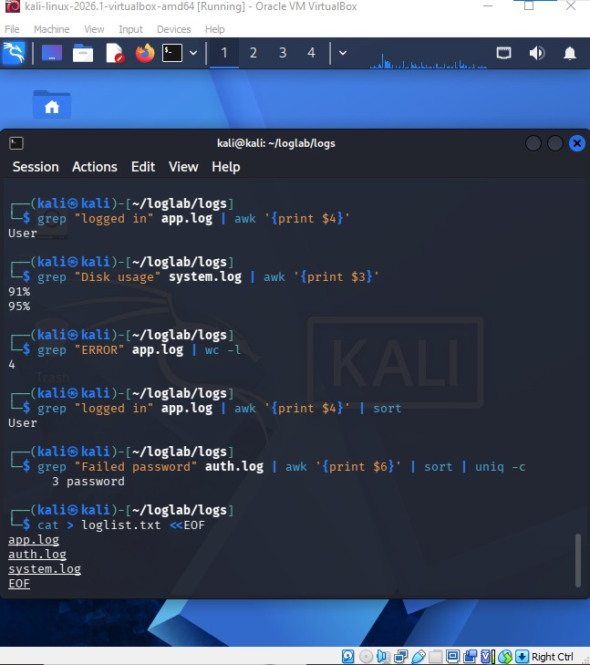
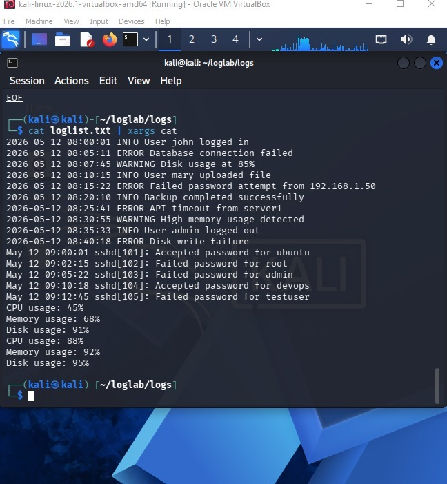
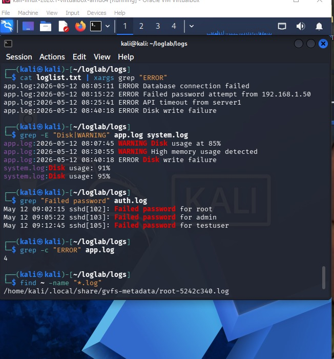

# Linux Fundamentals: Labs
This file contains the hands-on lab instructions for the course.
Here is the screenshot demonstrating the successful execution of the 
 command tasks:

Here is the screenshot showing xargs usage and the final system health incident report summary:

